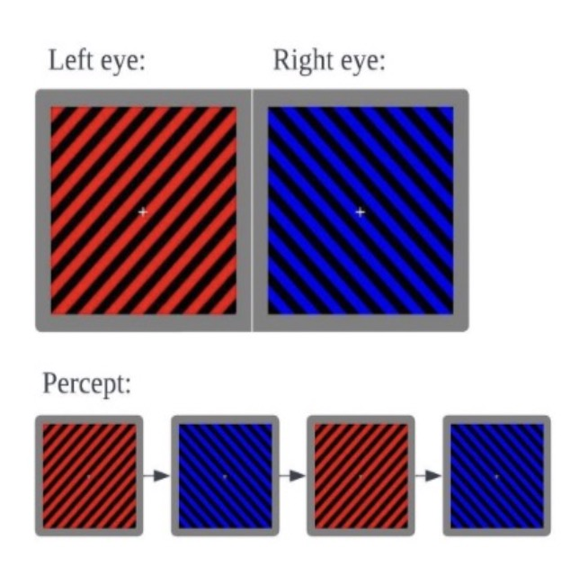
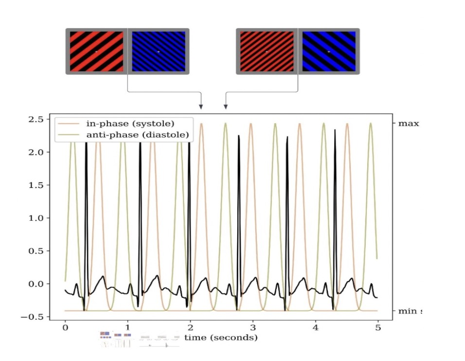

```{r setup, include = TRUE, warning = FALSE}
#library("papaja")
#r_refs("r-references.bib")
#tinytex::install_tinytex(version = "2020.10")
#tinytex::install_tinytex(bundle = 'TinyTeX')
source("Assignment02.R")
```

```{r, echo = FALSE, message = FALSE, warning = FALSE}
library(dplyr)
library(readr)
library(tidyverse)
library(ggplot2)
library(stats)
library(knitr)
library(kableExtra)
library(lme4)
library(sjPlot)
```

```{r Counting number of files, echo = FALSE}
folder_path <- "bids_dataset/Binocular_rivalry"
files <- list.files(folder_path)
```

```{r read-and-compile-participants, message = FALSE, warning = FALSE, echo = FALSE, warning = FALSE}
# creating a loop to extra all of the participants' information
participant_data <- c()
for(id in 1:58){
  for(session_id in 1:2){
    file_name <- sprintf("sub-%02d_task-rivalry_run-%02d_events", id, session_id)
    file_path <- file.path(folder_path, paste0(file_name, ".tsv"))
# debugging    
#    cat("Checking file:", file_path, "\n")
    if (file.exists(file_path)){
      participant_session_data <- read_tsv(file_path, show_col_types = FALSE)
# adding participant id and session id      
      participant_session_data$subject <- id
      participant_session_data$session <- session_id
# append all of participants information into a single data
      participant_data <- append(participant_data, list(participant_session_data))
  }
}}
final <- bind_rows(participant_data)
```

```{r grouping datas, warning = FALSE, echo = FALSE}
sub_data <- final %>% 
  mutate(duration = as.numeric(duration)) %>% 
  drop_na(duration) %>% 
  group_by(subject,dominant) %>% 
  summarize(total_duration = sum(duration, na.rm = TRUE))
```

```{r average duration,echo = FALSE}
average_duration <- final %>%
  filter(!(duration == "n/a" | dominant == "n/a")) %>% 
  group_by(subject, sync_side, dominant) %>%
  summarize(average_duration = mean(as.numeric(duration), na.rm = TRUE))
```

```{r total duration, echo = FALSE}
filtered_data <- final %>% 
  filter(!(duration == "n/a" | dominant == "n/a")) %>% 
  mutate(duration = as.numeric(duration)) %>%
  data.frame()
```

```{r descreptive analysis, echo = FALSE, message = FALSE, warning = FALSE}
# As we can see from the summary, participant on average spent 2.42 seconds on viewing each stimulus. Mean = 2.42, Median = # 1.91. Min = 0.05, max = 57.03

# Create a subset for synchronous durations
synchronous_data <- filtered_data[filtered_data$dominant == "synchronous", ]

# Create a subset for asynchronous durations
asynchronous_data <- filtered_data[filtered_data$dominant == "asynchronous", ]


# Calculate mean, max, min, and median for synchronous durations
mean_synchronous <- mean(synchronous_data$duration)
max_synchronous <- max(synchronous_data$duration)
min_synchronous <- min(synchronous_data$duration)
median_synchronous <- median(synchronous_data$duration)

# Calculate mean, max, min, and median for asynchronous durations
mean_asynchronous <- mean(asynchronous_data$duration)
max_asynchronous <- max(asynchronous_data$duration)
min_asynchronous <- min(asynchronous_data$duration)
median_asynchronous <- median(asynchronous_data$duration)
```


```{r analysis-preferences}
# Seed for random number generation
set.seed(42)
knitr::opts_chunk$set(cache.extra = knitr::rand_seed)
```

# Introduction

Though we are unconscious of most bodily sensations (e.g. immune system), in a place where the internal (i.e. self) and external (i.e. physical world) interact, interoceptive stimuli—the sensation that arises from an internal organ (e.g. heartbeat), have been found to yield an unexpected influence over how we see and sense the world (i.e. exteroceptive stimuli).  
A substantial prior study has been dedicated to exploring how external stimuli affect our body and brain. For example, intentionally observing and recognizing external stimuli typically results in a deceleration of the heart rate, referred to as “bradycardia of attention” [@lacey1963visceral]. Such an effect is further examined in a follow-up study that showed subjects’ heart rate decreased following a ready signal [@laceyTwowayCommunicationHeart1978]. These findings have provided us with a novel understanding of how exteroceptive stimuli (e.g. a ready signal at a traffic light) influence our interoceptive stimuli (e.g. heart rate), but also raise the interesting question about the reverse effect: could interoceptive stimuli have an influence on exteroceptive stimuli? The question may seem counterintuitive at first since most of the interoceptive stimuli within one’s self are not accessible (e.g. immune system, heartbeat). For example, studies have suggested that only a quarter of the participants can perceive and judge their heart rate that is closely synchronized with external stimuli above chance [@brener_towards_2016]. How can these interoceptive stimuli affect our perception of the world if we, for the most of time, do not have conscious access to them? Yet, recent research has shed light on this question.
For instance, the heart rate and gastrointestinal tract (GI) are shown to be continuously producing electrical activity, thus sending messages to the brain, and eventually altering our perception and cognition [@azzalini_visceral_2019;@monti2022gut]. In addition, it is suggested that interoceptive stimuli may play a significant role in shaping emotions and cognition, and this process is derived from a low-level function—homeostatic regulation [@smithHierarchicalBasisNeurovisceral2017]. These emotional states can, in turn, affect how we perceive the world. For instance, we may perceive a neutral stimulus as threatening when we are in an anxious state. 
One study investigating the subjective experience of body ownership (EBO) presented even more compelling evidence of interaction between interoceptive and exteroceptive stimuli by showing that during the induction of a “fake” rubber hand, participants exhibited an increased sense of EBO if the heartbeat were synchronized with the color change of the rubber hand  [@suzuki_multisensory_2013]. These similar embodiment effect were also observed in breathing[@montiEmbreathmentIllusionHighlights2020].Another study delves into examining how activation of certain cortical areas impacts subjects’ hits and misses on a visual signal detection task: participants were asked to identify whether or not they saw a faint annulus; the study showed that the activation of ventromedial prefrontal cortex bilaterally (vACC-vmPFC), the site known for receiving cardiac inputs, were more likely to have participants consciously perceive the faint annulus [@park_spontaneous_2014]. 
Recently, the impact of cardiac activity on exteroceptive perception gained significant attention, particularly fueled by recent theories emphasizing the crucial role of interoception in shaping the subjective sense of self[@park_spontaneous_2014;@sethBeingBeastMachine2018].
To our knowledge, despite these prior investigations on interoceptive and exteroceptive interaction, there is limited research that closely examines this effect visually. Also, there is still a notable gap in the existing literature, particularly in the context of visual bistable perceptual switching. Visual bistable perceptual switching refers to presenting participants with two visual stimuli, each of which dominates the visual field for a short period of time. This is usually achieved by using the binocular rivalry paradigm [@carmel_how_2010]. While prior studies have primarily investigated the realm of detection thresholds (A binary response: whether the signal or not), it is important to study this effect more comprehensively in a bistable perception. When perception oscillates between two ambiguous stimuli, it suggests dynamic processes at play in the brain. Understanding the mechanism of how the brain suppresses these perceptual ambiguities can shed light on fundamental aspects of perception and consciousness. 
To fill in the gap, our research plans to use a binocular rivalry paradigm [@carmel_how_2010], where one of two competing visual stimuli will be synchronized with the subjects’ heartbeat (i.e. electrocardiogram ECG signals) in real-time. Our goal is to investigate whether the synchronization of interoceptive stimuli (i.e. heartbeat) will influence the prioritization of the visual stimuli in conscious awareness. Based on earlier studies that examined the effect of interoceptive stimuli on the brain [@azzalini_visceral_2019] and homeostasis regulation [@smithHierarchicalBasisNeurovisceral2017], we hypothesized to find that the visual stimulus that matched with the participant’s real-time heartbeat should overall dominate the visual field longer than the stimulus that was not synchronized. In addition, we also expect to see that this effect is not dependent on participants' conscious awareness of their heartbeat sensations. 


# Methods
  As written in my authornote, my role in this study include data collection, writing the original draft preparation, as well as review and editing.
  Our experiment is going to be divided into two parts.In the first section, we are planning to use a binocular rivalry paradigm -- presenting different visual stimuli, one to each eye of the participant; because the brain cannot process two visual stimuli simultaneously, one visual stimulus will dominate the other visual stimulus, see Figure 1. 


The idea is to synchronize one of the visual stimuli with the participant's heartbeat (measured by using an electrocardiogram ECG) in real-time; the synchronization of the heartbeat and visual stimulus is randomized, see Figure 2.

Participants are not going to be told that one of the stimuli was synchronized with their real-time ECG; the Participants will identify which visual stimulus they are currently viewing by pressing the left (red) and right (blue) arrow keys.
  In the second section, we are going to measure whether the participants could judge the external stimulus that is synchronized with their own heartbeat correctly. This will be done by presenting two pulsing circles, one synchronizes with the participant's ECG (immediately followed at the R peak) and the other one does not (followed later after the R peak).

## Participants

  We aim to collect 60 undergraduate students taking Psychology courses at the University of Chicago. We are going to recruit participants through an online platform named SONA (Psychological and Brain Science Research System). Participants will need to have normal color vision and see well without glasses, as well as consent to participate in our study. Our participants' sample may not be representative since our sample consists of only college students, specifically students who are taking introductory Psychology courses. The introductory Psychology courses include a diverse population of students with different majors and backgrounds, but it is biased toward college and well-educated students at University of Chicago. However, as mentioned above, we do not expect that our results will vary significantly across races and genders since this effect is mostly driven by biological factors within the body. We are going to send our study protocol to the University of Chicago institutional review board for approval.

## Material

Electrocardiogram (ECG) signals were recorded with a TMSi SAGA amplifier (TMSi, Netherlands) at a sampling rate of 100 Hz.The ECG data, accessible in Python (refer to Data and Code Availability), underwent processing through the Lab Streaming Layer (LSL, labstreaminglayer.org).To enhance signal quality, the ECG data was subjected to bandpass filtering within the frequency range of 5-15 Hz. The detection of R-peaks was accomplished utilizing the Pan-Thompkins algorithm [@panRealTimeQRSDetection1985], adapted from a pre-existing implementation for compatibility with LabGraph [@michalsznajderPythonOnlineOffline2017].

## Data analysis

We used `r cite_r("my_library.bib")` for all our analyses.

# Results

The mean duration of synchronous stimulus is `r round(mean_synchronous,3)`, and the meadian is `r round(median_synchronous,3)`; the mean duration of asynchronous stimulus is `r round(mean_asynchronous,3)`, and the median is `r round(median_asynchronous,3)`

The results of the generalized linear mixed-effects model (glmer) are presented in (Table \@ref(tab:kable)). The glmer revealed significant effects for the dominant variable (Estimate=0.02, t=2.64, p<0.05). This suggests that on average, the duration is expected to be increase by 0.02 seconds for synchronous stimulus compared to asynchronous stimulus. 

# Discussion
Although the research field has shifted attention to study interoceptive stimuli on exteroceptive stimuli, there are a limited number of studies that examined this effect in vision. In addition, previous studies tend to focus on investigating this effect with a detection threshold paradigm (A binary response: whether the signal or not), it is unclear the mechanism that the brain uses to suppress perceptual ambiguity.  
The results of our study extend beyond a simple examination of interoceptive stimuli of exteroceptive stimuli. Understanding the influential effect of our unconscious internal sensations on our conscious perception has a broader meaning across various aspects of human life and the scientific field. An enhanced understanding of interoceptive cues could facilitate new and more effective ways of treating mental disorders such as depression and anxiety. For instance, if the accelerated heartbeat is causing a negative emotional state and thus leading to symptoms of depression and anxiety, therapies could develop new interventions that aim to help the patients become more aware of the interoceptive stimuli, making individuals manage the emotional impact led by interoceptive stimuli, thereby alleviate the depression and anxiety symptoms. Furthermore, interoceptive stimuli such as heartbeat, accompanied with other diagnostic criteria can be used as a sign to predict certain mental disorders. For example, anxiety is marked by excessive worries and fears that tend to trigger a fight or flight response. The heartbeat is likely to get accelerated when an individual is deciding whether to fight or flight. Therefore, internal sensations such as heartbeat, can also serve as a complementary diagnostic information to improve current therapeutic interventions. 
The present study was conducted within a controlled laboratory environment, which may limit the extent to which the findings can be extrapolated to real-world settings. While the controlled environment allowed for precise manipulation of variables, the ecological validity of the results may be constrained. Future research could consider incorporating more ecologically valid scenarios to enhance the external validity of the study.Another potential limitation of this study is the specificity of the sample population. Participants in this study were students from University of Chicago, and caution should be exercised when generalizing the findings to a broader and more diverse population. Future research could explore the generalizability of the observed effects across different demographic groups to provide a more comprehensive understanding of the phenomenon under investigation.

```{r lineplot, fig.cap = "Average Duration for Syn and Asyn", warning = FALSE, message = FALSE}
ggplot(average_duration, aes(x = dominant, 
                             y = average_duration,
                             group = subject,
                             color = factor(subject)))+
  geom_line(linewidth = .3, alpha = .5) +
  geom_point(size = 3) +
  stat_summary(aes(group = 1), fun = mean, geom = "line", linetype = "solid", color = "black", size = 1) +
  labs(title = "Average duration for syn and asyn",
       x = "Dominance",
       y = "Average Duration",
       subtitle = "n=54") +
  facet_wrap(~sync_side, scales = "free") +
  theme_minimal()
```


```{r Histogram, fig.cap = "Histogram for substracted difference", warning = FALSE, message = FALSE}
average_diff <- average_duration %>%
  group_by(subject, sync_side) %>%
  summarise(diff_duration = mean(average_duration[dominant == "synchronous"]) - mean(average_duration[dominant == "asynchronous"]))

ggplot(average_diff, aes(x = diff_duration)) +
  geom_histogram(binwidth = 0.1, fill = "blue", color = "black", alpha = 0.7) +
  labs(title = "Difference in Average Duration (Syn - Asyn)",
       x = "Difference in Duration",
       y = "Count",
       subtitle = "n=54") +
  facet_wrap(~sync_side, scales = "free") +
  theme_minimal()
```

```{r glmer dominant and subject, echo = FALSE, warning = FALSE, message = FALSE}
fit <- glmer(duration ~ dominant + (1|subject), 
              family = Gamma(link = 'log'), 
              data = filtered_data)

# tab_model(fit, show.se = TRUE, show.df = TRUE, show.stat = TRUE)

```

```{r kable, echo = FALSE, fig.cap = "Generalized Linear Mixed-Effects Models random intercept subject"}
# Extracting information from the GLMM summary
summary_data <- data.frame(
  Effect = c("Intercept", "Dominant"),
  Estimate = c(0.927540, 0.019123),
  `SEr` = c(0.045024, 0.007245),
  `t-value` = c(20.601, 2.639),
  `p-value` = c("< 2e-16", "0.00831**")
)


# Print the table using kable
caption_text = "Generalized Linear Mixed-Effects Models subject random intercept"
fit2_kable <- kable(summary_data, 
      align = c("l", "r", "r", "r", "r"),
      escape = FALSE,
      caption = caption_text,
      row_spec = list(c(0:10), background = rep(c("#f7f7f7", "#ffffff"), length.out = 11)))%>%
  kable_styling(position = "left", full_width = F, font_size = 15) %>% 
  column_spec(1:5, width = "1in") %>%
  add_header_above(c(" ", "Estimate and SE" = 2, "Model fit" = 2))

# Add a footnote inside the table
fit2_kable <- fit2_kable %>%
  footnote(general = "*p < 0.05, **p < 0.01, ***p < 0.001")
fit2_kable
```

\newpage

# References


